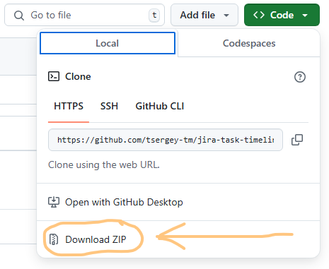
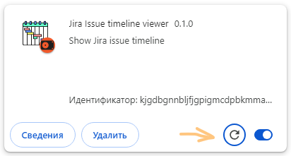

# Jira Issue timeline viewer

Это плагин для Google Chrome, чтобы смотреть временную диаграму истории изменения полей в задаче в Atlassian Jira.
Плагин решает проблему, что в Jira нет отображения диаграммы изменений состояний полей.
Скорее всего вы будете использовать его для того, чтобы отследить изменения состояний задачи и чеклистов.

Запускайте плагин на открытой в хроме задаче.

## Установка

### Установка из архива

Установка из архива не потребует настройки git.
Но для обновления архивы придётся скачивать руками.

Скачайте архив со страницы https://github.com/tsergey-tm/jira-task-timeline, в разделе Code -> Download ZIP.


Распаковываете архив в каталог, где будете держать плагин.

Продолжение в [установка плагина](#установка-плагина).

### Установка с помощью git

У вас должен быть установлен git или любой его клиент. Для Windows можно использовать https://tortoisegit.org/

Переходим в каталог, где будете держать плагин.
Там выполняете

```bash
git clone https://github.com/tsergey-tm/jira-task-timeline.git
``` 

Или через клиента получаете файлы из https://github.com/tsergey-tm/jira-task-timeline.git

### Установка плагина

Заходим в хроме в [chrome://extensions/](chrome://extensions/).

Там включаем режим разработчика:


Нажимаем "Загрузить распакованное расширение" и указываем каталог jira-task-timeline.

## Обновление

### Обновление из zip

Снова качаете архив и распаковываете в то же самое место.

### Обновление из git

Для обновления надо перейти в каталог jira-task-timeline
и выполнить команду pull в клиенте

```bash
git pull
```

### Обновление плагина

После этого заходим в хроме в [chrome://extensions/](chrome://extensions/)
и на плагине Jira Issue timeline viewer нажимаем кнопку обновления:



## Запуск плагина

Перейдите в задачу в Jira и в списке плагинов нажмите на иконку .
Если Jira будет опознана плагином, то в выпадающем окне появится кнопка,
чтобы открыть окно со статистикой.

